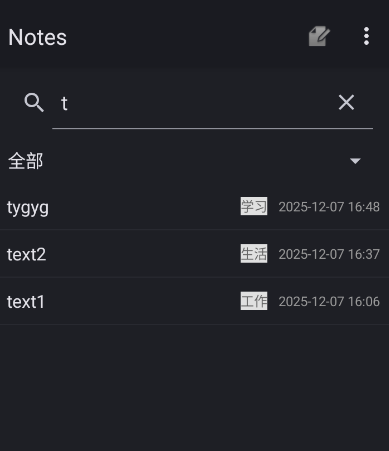
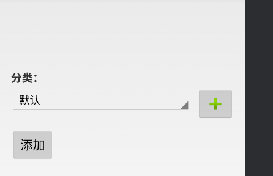
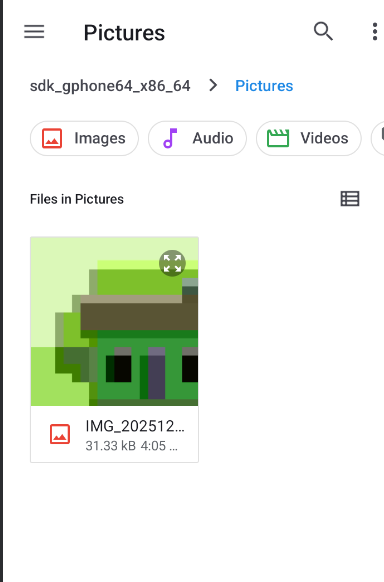
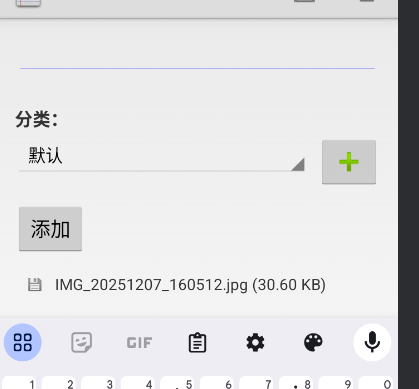
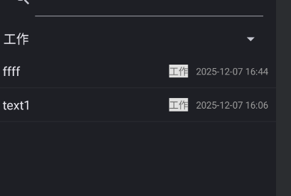
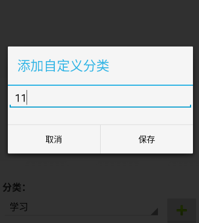

# NotePad
项目来自于官方早期的数据库操作的基本教程。
更多的解析参考[Android Sample--NotePad解析](https://blog.csdn.net/llfjfz/article/details/67638499)
项目更新内容：
#一、在每条记录的最后添加了时间戳

##有关代码
###在NotesList中添加
//新增修改时间字段
private static final String[] PROJECTION = new String[] {
        NotePad.Notes._ID, // 0
        NotePad.Notes.COLUMN_NAME_TITLE, // 1
        NotePad.Notes.COLUMN_NAME_MODIFICATION_DATE // 2 新增：最后修改时间
};

 //新增修改时间字段的索引
    private static final int COLUMN_INDEX_MODIFY_DATE = 2;
    
  // 自定义适配器格式化时间
            mAdapter = new SimpleCursorAdapter(
                    this,
                    R.layout.noteslist_item,
                    cursor,
                    dataColumns,
                    viewIDs
            ) 

   public void bindView(View view, Context context, Cursor cursor) {
                    super.bindView(view, context, cursor);
                    // 格式化修改时间
                    long modifyTime = cursor.getLong(COLUMN_INDEX_MODIFY_DATE);
                    String timeStr = new SimpleDateFormat("yyyy-MM-dd HH:mm", Locale.getDefault())
                            .format(new Date(modifyTime));
                    TextView timeTv = (TextView) view.findViewById(R.id.note_modify_time);
                    timeTv.setText(timeStr);
                    
  ###修改对应的布局
     <!--添加的时间戳-->
    <TextView
        android:id="@+id/note_modify_time"
        android:layout_width="wrap_content"
        android:layout_height="wrap_content"
        android:layout_marginStart="10dp"
        android:layout_marginLeft="10dp"
        android:textColor="#999999"
        android:textSize="12sp" />
  #二、在顶端添加了搜索框
  

  ##搜索关键词
   
  
  ##有关代码
  ###创建的新文件
  ####notes_list.xml
  <?xml version="1.0" encoding="utf-8"?>
<LinearLayout 
    xmlns:android="http://schemas.android.com/apk/res/android"
    android:layout_width="match_parent"
    android:layout_height="match_parent"
    android:orientation="vertical">

    <!-- 搜索框 -->
    <androidx.appcompat.widget.SearchView
        android:id="@+id/note_search_view"
        android:layout_width="match_parent"
        android:layout_height="wrap_content"
        android:layout_margin="8dp"
        android:hint="搜索笔记标题/内容"/>

    <!-- 笔记列表（复用原 ListView） -->
    <ListView
        android:id="@android:id/list"
        android:layout_width="match_parent"
        android:layout_height="match_parent"/>

    <!-- 搜索无结果提示 -->
    <TextView
        android:id="@+id/empty_view"
        android:layout_width="match_parent"
        android:layout_height="match_parent"
        android:gravity="center"
        android:text="未找到匹配的笔记"
        android:textColor="#999999"
        android:visibility="gone"/>

</LinearLayout>
###修改NotesList.java
// 关键修改1：替换默认布局为带搜索框的布局
        setContentView(R.layout.notes_list);
      // 关键修改2：初始化搜索框
        initSearchView();

        // 关键修改3：初始化列表（支持搜索过滤）
        updateNoteList(mSearchKeyword);

        // 关键修改4：设置无结果提示
        getListView().setEmptyView(findViewById(R.id.empty_view));

         /**
     * 新增方法：初始化搜索框，监听输入事件
     */
    private void initSearchView() {
        SearchView searchView = findViewById(R.id.note_search_view);
        // 禁用搜索按钮，仅实时过滤
        searchView.setImeOptions(EditorInfo.IME_ACTION_DONE);
        searchView.setSubmitButtonEnabled(false);
        // 展开搜索框（默认不折叠）
        searchView.setIconifiedByDefault(false);

        // 监听搜索文本变化
        searchView.setOnQueryTextListener(new SearchView.OnQueryTextListener() {
            @Override
            public boolean onQueryTextSubmit(String query) {
                return false; // 无需处理提交，实时过滤
            }

            @Override
            public boolean onQueryTextChange(String newText) {
                // 保存关键词并更新列表
                mSearchKeyword = newText.trim();
                updateNoteList(mSearchKeyword);
                return true;
            }
        });
    }

    /**
     * 新增方法：根据搜索关键词更新笔记列表
     * @param keyword 搜索关键词（空则显示全部）
     */
    private void updateNoteList(String keyword) {
        // 构建搜索条件：模糊匹配标题（支持搜索内容，只需放开注释）
        String selection = null;
        String[] selectionArgs = null;
        if (!keyword.isEmpty()) {
            // 模糊搜索标题：%keyword%（SQLite 通配符）
            selection = NotePad.Notes.COLUMN_NAME_TITLE + " LIKE ?";
            selectionArgs = new String[]{"%" + keyword + "%"};
            
            // selection = NotePad.Notes.COLUMN_NAME_TITLE + " LIKE ? OR " +
            //         NotePad.Notes.COLUMN_NAME_NOTE + " LIKE ?";
            // selectionArgs = new String[]{"%" + keyword + "%", "%" + keyword + "%"};
        }

        // 执行查询（替换原固定查询）
        Cursor cursor = managedQuery(
                getIntent().getData(),            // 数据源URI
                PROJECTION,                       // 查询字段
                selection,                        // 筛选条件（搜索关键词）
                selectionArgs,                    // 筛选参数
                NotePad.Notes.DEFAULT_SORT_ORDER  // 排序规则
        );

        // 初始化/更新适配器
        if (mAdapter == null) {
            // 数据列与视图ID映射
            String[] dataColumns = {
                    NotePad.Notes.COLUMN_NAME_TITLE,
                    NotePad.Notes.COLUMN_NAME_MODIFICATION_DATE
            };
            int[] viewIDs = {
                    android.R.id.text1,
                    R.id.note_modify_time
            };

            // 自定义适配器格式化时间
            mAdapter = new SimpleCursorAdapter(
                    this,
                    R.layout.noteslist_item,
                    cursor,
                    dataColumns,
                    viewIDs
            ) {
                @Override
                public void bindView(View view, Context context, Cursor cursor) {
                    super.bindView(view, context, cursor);
                    // 格式化修改时间
                    long modifyTime = cursor.getLong(COLUMN_INDEX_MODIFY_DATE);
                    String timeStr = new SimpleDateFormat("yyyy-MM-dd HH:mm", Locale.getDefault())
                            .format(new Date(modifyTime));
                    TextView timeTv = view.findViewById(R.id.note_modify_time);
                    timeTv.setText(timeStr);
                }
            };
            setListAdapter(mAdapter);
        } else {
            // 更新适配器数据（避免重复创建）
            mAdapter.changeCursor(cursor);
        }
    }
    ##遇到的问题
    在一开始进行搜索框的添加的时候，没有注意有关布局文件之间的关系，没有创建新的布局文件就直接进行搜索框的添加，导致了一开始是直接所有笔记的上方都有一个搜索框，最后又创建了布局文件notes_list.xml，解决了该问题
 #三、实现添加附件的功能
 ##添加附件的界面显示
 
 
##点击添加后会显示

##点击对应图片后添加进编辑界面的显示

 ##注意事项
 因为是添加了附件，所以是需要在数据库中再添加新的表，而且还需要在对原有的表增删改查的基础上，添加对新表的增删改查，添加新的映射，所以代码的修改涉及到了NotePad、NotePadProvider.

 ##有关代码
 ###NotePad.java
  // 新增：附件表常量（关键）
    public static final class Attachments implements BaseColumns {
        public static final String TABLE_NAME = "attachments"; // 附件表名
        public static final String COLUMN_NAME_NOTE_ID = "note_id"; // 关联笔记ID（外键）
        public static final String COLUMN_NAME_FILE_TYPE = "file_type"; // 文件类型（image/audio/video）
        public static final String COLUMN_NAME_FILE_PATH = "file_path"; // 应用私有目录路径
        public static final String COLUMN_NAME_FILE_NAME = "file_name"; // 原始文件名
        public static final String COLUMN_NAME_FILE_SIZE = "file_size"; // 文件大小（字节）
        public static final Uri CONTENT_URI = Uri.parse("content://" + AUTHORITY + "/attachments"); // 附件URI
        public static final String CONTENT_TYPE = "vnd.android.cursor.dir/vnd.google.note.attachment"; // 多条附件MIME
        public static final String CONTENT_ITEM_TYPE = "vnd.android.cursor.item/vnd.google.note.attachment"; // 单条附件MIME
        public static final String DEFAULT_SORT_ORDER = "_id ASC"; // 默认排序
    }
    
 ###NotePadProvider
 // 新增：附件表的URI匹配码（关键）
    private static final int ATTACHMENTS = 4;         // 所有附件
    private static final int ATTACHMENT_ID = 5;       // 单个附件
    private static final int NOTE_ATTACHMENTS = 6;    // 某条笔记的所有附件
    // 新增：附件表URI匹配规则（关键）
        sUriMatcher.addURI(NotePad.AUTHORITY, "attachments", ATTACHMENTS); // 匹配 content://.../attachments
        sUriMatcher.addURI(NotePad.AUTHORITY, "attachments/#", ATTACHMENT_ID); // 匹配 content://.../attachments/1
        sUriMatcher.addURI(NotePad.AUTHORITY, "notes/#/attachments", NOTE_ATTACHMENTS); // 匹配 content://.../notes/1/attachments
        // 新增：附件表投影映射（关键）
        sAttachmentProjectionMap = new HashMap<>();
        sAttachmentProjectionMap.put(NotePad.Attachments._ID, NotePad.Attachments._ID);
        sAttachmentProjectionMap.put(NotePad.Attachments.COLUMN_NAME_NOTE_ID, NotePad.Attachments.COLUMN_NAME_NOTE_ID);
        sAttachmentProjectionMap.put(NotePad.Attachments.COLUMN_NAME_FILE_TYPE, NotePad.Attachments.COLUMN_NAME_FILE_TYPE);
        sAttachmentProjectionMap.put(NotePad.Attachments.COLUMN_NAME_FILE_PATH, NotePad.Attachments.COLUMN_NAME_FILE_PATH);
        sAttachmentProjectionMap.put(NotePad.Attachments.COLUMN_NAME_FILE_NAME, NotePad.Attachments.COLUMN_NAME_FILE_NAME);
        sAttachmentProjectionMap.put(NotePad.Attachments.COLUMN_NAME_FILE_SIZE, NotePad.Attachments.COLUMN_NAME_FILE_SIZE);

###NoteEditor
// 新增：附件相关常量和变量
    private static final int REQUEST_SELECT_FILE = 100; // 文件选择请求码
    private static final String[] SUPPORTED_MIME_TYPES = {
            "image/*",  // 图片
            "audio/*",  // 音频
            "video/*"   // 视频
    };
    private long mNoteId; // 当前笔记ID（用于关联附件）
    private LinearLayout mAttachmentContainer; // 附件预览容器

// 新增：设置布局（使用修改后的note_editor.xml）
        setContentView(R.layout.note_editor);

  /**
     * 打开文件选择器（选择图片/音频/视频）
     */
    private void selectFile() {
        Intent intent = new Intent(Intent.ACTION_GET_CONTENT);
        intent.setType("*/*"); // 所有文件类型
        intent.putExtra(Intent.EXTRA_MIME_TYPES, SUPPORTED_MIME_TYPES); // 限制支持的类型
        intent.addCategory(Intent.CATEGORY_OPENABLE); // 只显示可打开的文件
        startActivityForResult(
                Intent.createChooser(intent, getString(R.string.select_attachment)),
                REQUEST_SELECT_FILE
        );
    }

    /**
     * 处理文件选择结果
     */
    @Override
    protected void onActivityResult(int requestCode, int resultCode, Intent data) {
        super.onActivityResult(requestCode, resultCode, data);
        if (requestCode == REQUEST_SELECT_FILE && resultCode == RESULT_OK && data != null) {
            Uri fileUri = data.getData();
            if (fileUri != null) {
                // 复制文件到应用私有目录并保存附件信息到数据库
                saveAttachment(fileUri);
            }
        }
    }

    /**
     * 保存附件：1.复制文件到应用私有目录 2.插入附件信息到数据库
     */
    private void saveAttachment(Uri fileUri) {
        try {
            // 1. 获取文件信息（名称、类型、大小）
            String fileName = getFileName(fileUri);
            String fileType = getContentResolver().getType(fileUri);
            long fileSize = getContentResolver().openInputStream(fileUri).available();

            // 2. 复制文件到应用私有目录（data/data/包名/files/）
            // 生成唯一文件名（避免重复）
            String destFileName = "attachment_" + System.currentTimeMillis() + "_" + fileName;
            copyFileToPrivateDir(fileUri, destFileName);

            // 3. 插入附件信息到数据库（关联当前笔记ID）
            ContentValues values = new ContentValues();
            values.put(NotePad.Attachments.COLUMN_NAME_NOTE_ID, mNoteId);
            values.put(NotePad.Attachments.COLUMN_NAME_FILE_TYPE, fileType);
            values.put(NotePad.Attachments.COLUMN_NAME_FILE_PATH, destFileName);
            values.put(NotePad.Attachments.COLUMN_NAME_FILE_NAME, fileName);
            values.put(NotePad.Attachments.COLUMN_NAME_FILE_SIZE, fileSize);

            getContentResolver().insert(NotePad.Attachments.CONTENT_URI, values);

            // 4. 刷新附件预览列表
            loadAttachments();
            Toast.makeText(this, R.string.attachment_add_success, Toast.LENGTH_SHORT).show();

        } catch (IOException e) {
            Log.e(TAG, "保存附件失败", e);
            Toast.makeText(this, R.string.attachment_add_fail, Toast.LENGTH_SHORT).show();
        }
    }

    /**
     * 加载当前笔记的所有附件（生成预览视图）
     */
    private void loadAttachments() {
        // 清空现有预览（避免重复）
        mAttachmentContainer.removeAllViews();

        // 查询当前笔记的所有附件（使用NOTE_ATTACHMENTS URI模式）
        Uri attachmentsUri = Uri.parse(NotePad.Notes.CONTENT_URI + "/" + mNoteId + "/attachments");
        Cursor cursor = getContentResolver().query(
                attachmentsUri,
                new String[]{
                        NotePad.Attachments._ID,          // 附件ID
                        NotePad.Attachments.COLUMN_NAME_FILE_TYPE, // 文件类型
                        NotePad.Attachments.COLUMN_NAME_FILE_NAME, // 文件名
                        NotePad.Attachments.COLUMN_NAME_FILE_SIZE  // 文件大小
                },
                null, null, null
        );

        if (cursor != null) {
            while (cursor.moveToNext()) {
                long attachmentId = cursor.getLong(0);
                String fileType = cursor.getString(1);
                String fileName = cursor.getString(2);
                long fileSize = cursor.getLong(3);

                // 为每个附件创建预览视图并添加到容器
                View attachmentView = createAttachmentView(attachmentId, fileType, fileName, fileSize);
                mAttachmentContainer.addView(attachmentView);
            }
            cursor.close();
        }
    }

    /**
     * 创建附件预览视图（根据文件类型显示不同图标，支持删除和打开）
     */
    private View createAttachmentView(long attachmentId, String fileType, String fileName, long fileSize) {
        // 加载附件项布局
        View view = getLayoutInflater().inflate(R.layout.item_attachment, null);

        // 1. 设置附件类型图标
        ImageView ivIcon = view.findViewById(R.id.iv_attachment_icon);
        if (fileType.startsWith("image/")) {
            ivIcon.setImageResource(R.drawable.ic_image); // 图片图标
        } else if (fileType.startsWith("audio/")) {
            ivIcon.setImageResource(R.drawable.ic_audio); // 音频图标
        } else if (fileType.startsWith("video/")) {
            ivIcon.setImageResource(R.drawable.ic_video); // 视频图标
        }

        // 2. 设置文件名和大小
        TextView tvName = view.findViewById(R.id.tv_attachment_name);
        TextView tvSize = view.findViewById(R.id.tv_attachment_size);
        tvName.setText(fileName);
        tvSize.setText(formatFileSize(fileSize));

        // 3. 删除按钮点击事件
        ImageView ivDelete = view.findViewById(R.id.iv_attachment_delete);
        ivDelete.setOnClickListener(v -> {
            // 从数据库删除附件（会触发Provider删除对应的物理文件）
            Uri attachmentUri = ContentUris.withAppendedId(NotePad.Attachments.CONTENT_URI, attachmentId);
            getContentResolver().delete(attachmentUri, null, null);
            // 刷新附件预览
            loadAttachments();
        });

        // 4. 点击附件：打开文件（图片显示、音频/视频播放）
        view.setOnClickListener(v -> {
            // 查询附件的文件路径
            Uri attachmentUri = ContentUris.withAppendedId(NotePad.Attachments.CONTENT_URI, attachmentId);
            Cursor cursor = getContentResolver().query(
                    attachmentUri,
                    new String[]{NotePad.Attachments.COLUMN_NAME_FILE_PATH},
                    null, null, null
            );

            if (cursor != null && cursor.moveToFirst()) {
                String filePath = cursor.getString(0);
                cursor.close();

                // 构建应用私有目录文件的URI
                File file = getFileStreamPath(filePath);
                Uri fileUri = Uri.fromFile(file);

                // 跳转系统应用打开文件
                Intent intent = new Intent(Intent.ACTION_VIEW);
                intent.setDataAndType(fileUri, fileType);
                intent.addFlags(Intent.FLAG_GRANT_READ_URI_PERMISSION); // 授予读取权限
                startActivity(intent);
            }
        });

        return view;
    }

##有关问题
因为图片的大小不能规范确定，所以最初在运行的时候会出现因为内存溢出而导致的只要点击含有图片的笔记就会闪退的情况，后面直接用对应图片名字来代替直接在文件中显示图片

#四、笔记分类
##有关界面

##有关笔记显示

##按照分类搜索笔记

##按照分类和对应关键词搜索笔记

##添加新的分类

##添加成功

##有关代码
###NoteList
  private void initCategoryFilter() {
        mCategorySpinner = (Spinner) findViewById(R.id.category_filter_spinner);
        // 初始化SharedPreferences
        mSharedPreferences = getSharedPreferences(PREFS_NAME, MODE_PRIVATE);
        
        // 加载分类列表（基础分类 + 自定义分类）
        loadCategories();
        
        // 设置选择监听器
        mCategorySpinner.setOnItemSelectedListener(new AdapterView.OnItemSelectedListener() {
            @Override
            public void onItemSelected(AdapterView<?> parent, View view, int position, long id) {
                String selectedItem = (String) parent.getItemAtPosition(position);
                if (getString(R.string.category_all).equals(selectedItem)) {
                    mSelectedCategory = "";
                } else {
                    mSelectedCategory = selectedItem;
                }
                // 更新列表
                updateNoteList(mSearchKeyword);
            }
            
            @Override
            public void onNothingSelected(AdapterView<?> parent) {
                // 不做任何操作
            }
        });
    }
 private void loadCategories() {
        // 基础分类列表（使用资源字符串保持一致性）
        String[] baseCategories = {
            getString(R.string.category_all),
            getString(R.string.category_work),
            getString(R.string.category_personal),
            getString(R.string.category_study)
        };
 // 显示分类信息
                    String category = cursor.getString(COLUMN_INDEX_CATEGORY);
                    TextView categoryTv = (TextView) view.findViewById(R.id.note_category);
                    if (category != null && !category.isEmpty()) {
                        categoryTv.setText(category);
                        categoryTv.setVisibility(View.VISIBLE);
                    } else {
                        categoryTv.setVisibility(View.GONE);
                    }
##有关问题
一开始的分类只能够在现有的几个之中进行分类，后面又添加了添加分类的功能。
